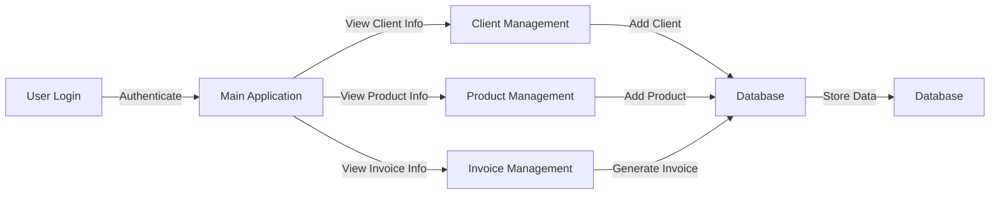

# Invoicing System
The Invoicing System is a comprehensive application designed to manage invoices, clients, products, and coupons for a business. It provides a user-friendly interface for users to log in, view client information, manage products, and generate invoices.

## Key Features
* User login and authentication
* Client management
* Product management
* Coupon management
* Invoice generation
* User-friendly interface

## Directory Hierarchy
```markdown
.
├── .gitignore
├── README.md
├── app.py
├── database.py
├── dialogs
│   ├── __init__.py
│   ├── cliente_dialog.py
│   ├── cliente_manual_dialog.py
│   ├── cupon_dialog.py
│   └── producto_dialog.py
├── estructura_propuesta.txt
├── login_window.py
├── main.py
├── models
│   ├── __init__.py
│   ├── cliente.py
│   ├── configuracion.py
│   ├── cupon.py
│   ├── detalle_factura.py
│   ├── factura.py
│   └── producto.py
├── models.py
├── templates
│   └── invoice_template.html
├── utils
│   ├── __init__.py
│   ├── config_manager.py
│   ├── excel_utils.py
│   ├── invoice_generator.py
│   ├── pdf_converter_module.py
│   └── whatsapp_sender_module.py
├── views
│   ├── __init__.py
│   ├── clientes_view.py
│   ├── configuracion_view.py
│   ├── cupones_view.py
│   ├── facturacion_view.py
│   ├── facturas_view.py
│   ├── productos_view.py
│   └── usuarios_view.py
```

## Module Functionality
The Invoicing System consists of several modules that interact with each other to provide the core functionality. The `database.py` module handles database operations, while the `models` module defines the structure of the data. The `dialogs` module contains classes for client, product, and coupon dialogs. The `utils` module provides utility functions for tasks such as invoice generation and PDF conversion. The `views` module contains classes for displaying client, product, and invoice information.

## Prerequisites and Installation
To run the Invoicing System, you need to have Python and the required libraries installed. The libraries used in this project include `tkinter` for the graphical user interface and `database` for database operations.

## Usage Example
```python
if __name__ == "__main__":
    sistema = SistemaFacturacion()
    sistema.run()
```

## Usage Restrictions
The Invoicing System is designed to run on a local machine and requires a database to store client, product, and invoice information. The system may not work properly if the database is not configured correctly or if the required libraries are not installed.

## Workflow Diagram

Note: The workflow diagram illustrates the main workflow of the Invoicing System, from user login to client, product, and invoice management. The diagram shows how the different modules interact with each other to provide the core functionality.