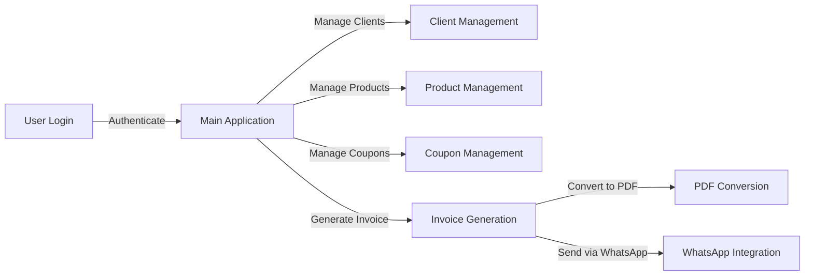

# Invoicing System
The Invoicing System is a comprehensive application designed to manage invoices, clients, products, and coupons. It provides a user-friendly interface for users to log in, view, and manage their data.

## Key Features
* User authentication and authorization
* Client management
* Product management
* Coupon management
* Invoice generation
* Excel and PDF conversion
* WhatsApp integration

## Directory Hierarchy
```markdown
.
├── .gitignore
├── README.md
├── app.py
├── database.py
├── dialogs
│   ├── __init__.py
│   ├── cliente_dialog.py
│   ├── cliente_manual_dialog.py
│   ├── cupon_dialog.py
│   └── producto_dialog.py
├── estructura_propuesta.txt
├── login_window.py
├── main.py
├── models
│   ├── __init__.py
│   ├── cliente.py
│   ├── configuracion.py
│   ├── cupon.py
│   ├── detalle_factura.py
│   ├── factura.py
│   └── producto.py
├── models.py
├── templates
│   └── invoice_template.html
├── utils
│   ├── __init__.py
│   ├── config_manager.py
│   ├── excel_utils.py
│   ├── invoice_generator.py
│   ├── pdf_converter_module.py
│   └── whatsapp_sender_module.py
└── views
    ├── __init__.py
    ├── clientes_view.py
    ├── configuracion_view.py
    ├── cupones_view.py
    ├── facturacion_view.py
    ├── facturas_view.py
    ├── productos_view.py
    └── usuarios_view.py
```

## Module Functionality
The Invoicing System consists of several modules, each responsible for a specific functionality:
* `app.py`: The main application module, responsible for initializing the application.
* `database.py`: The database module, responsible for interacting with the database.
* `dialogs`: A package containing dialog modules for client, product, and coupon management.
* `models`: A package containing model modules for client, product, coupon, and invoice management.
* `utils`: A package containing utility modules for configuration management, Excel and PDF conversion, and WhatsApp integration.
* `views`: A package containing view modules for client, product, coupon, and invoice management.

## Prerequisites and Environment Setup
### System Prerequisites
* Python 3.8 or later
* Tkinter library
* Database library (e.g., SQLite)

### Virtual Environment Setup
To create and activate a standard Python virtual environment:
```bash
python -m venv venv
source venv/bin/activate
```
Then, install the dependencies using pip:
```bash
pip install -r requirements.txt
```
### Configuration
#### Environment Variables
The following environment variables are required:
* `DATABASE_URL`: The URL of the database (e.g., `sqlite:///database.db`)
* `WHATSAPP_API_KEY`: The WhatsApp API key (e.g., `your_api_key_here`)

Example environment variable setup:
```bash
export DATABASE_URL="sqlite:///database.db"
export WHATSAPP_API_KEY="your_api_key_here"
```
#### JSON Configuration Files
The `config.json` file is used to store configuration parameters:
```json
{
    "database_url": "sqlite:///database.db",
    "whatsapp_api_key": "your_api_key_here"
}
```
Replace the placeholder values with your actual database URL and WhatsApp API key.

## Installation
To install the dependencies, run the following command:
```bash
pip install -r requirements.txt
```
## Usage Example
To run the application, execute the following command:
```bash
python main.py
```
## Usage Restrictions
* The application requires a valid database connection to function properly.
* The WhatsApp API key is required for WhatsApp integration.

## Workflow Diagram

Note: This diagram illustrates the main workflow of the application, from user login to invoice generation and WhatsApp integration.