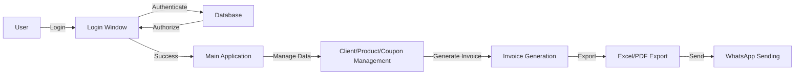

# Invoicing System
The Invoicing System is a comprehensive application designed to manage invoices, clients, products, and coupons for a business. It provides a user-friendly interface for users to log in, view, and manage their data.

## Key Features
* User authentication and authorization
* Client management
* Product management
* Coupon management
* Invoice generation
* Excel and PDF export

## Directory Hierarchy
```markdown
.
├── .gitignore
├── README.md
├── app.py
├── database.py
├── dialogs
│   ├── __init__.py
│   ├── cliente_dialog.py
│   ├── cliente_manual_dialog.py
│   ├── cupon_dialog.py
│   └── producto_dialog.py
├── estructura_propuesta.txt
├── login_window.py
├── main.py
├── models
│   ├── __init__.py
│   ├── cliente.py
│   ├── configuracion.py
│   ├── cupon.py
│   ├── detalle_factura.py
│   ├── factura.py
│   └── producto.py
├── templates
│   └── invoice_template.html
├── utils
│   ├── __init__.py
│   ├── config_manager.py
│   ├── excel_utils.py
│   ├── invoice_generator.py
│   ├── pdf_converter_module.py
│   └── whatsapp_sender_module.py
└── views
    ├── __init__.py
    ├── clientes_view.py
    ├── configuracion_view.py
    ├── cupones_view.py
    ├── facturacion_view.py
    ├── facturas_view.py
    ├── productos_view.py
    └── usuarios_view.py
```

## Module Functionality
The Invoicing System consists of several modules, each responsible for a specific functionality:
* `app.py`: The main application module, responsible for initializing the application.
* `database.py`: Handles database operations, such as connecting to the database and performing queries.
* `dialogs`: A package containing various dialog windows for client, product, and coupon management.
* `login_window.py`: Handles user authentication and login functionality.
* `main.py`: The entry point of the application, responsible for initializing the system and running the main loop.
* `models`: A package containing data models for clients, products, coupons, and invoices.
* `templates`: A directory containing HTML templates for invoice generation.
* `utils`: A package containing utility modules for Excel and PDF export, invoice generation, and WhatsApp sending.
* `views`: A package containing view modules for client, product, coupon, and invoice management.

## Prerequisites and Environment Setup
To run the Invoicing System, you will need:
* Python 3.x
* Tkinter library
* A database (the type of database is not specified in the provided code)

To set up the environment:
1. Create a virtual environment using `python -m venv venv` (assuming you have Python installed).
2. Activate the virtual environment using `source venv/bin/activate` (on Linux/Mac) or `venv\Scripts\activate` (on Windows).
3. Install the required dependencies using `pip install -r requirements.txt` (assuming a `requirements.txt` file is present in the repository).

## Installation
Since there is no `requirements.txt` file or any other package manager configuration file present in the repository, and no custom installation scripts are provided, the installation process is assumed to be manual. However, based on the provided code, it seems that the application uses a standard Python environment. Therefore, the installation process would involve creating a virtual environment, activating it, and installing the required dependencies manually.

## Usage Example
```bash
python main.py
```
This will run the Invoicing System application.

## Usage Restrictions
The Invoicing System is designed to run on a local machine and may not be suitable for large-scale or distributed environments. Additionally, the application may have specific requirements for the database and other dependencies.

## Workflow Diagram

Note: The workflow diagram illustrates the high-level workflow of the Invoicing System, from user login to invoice generation and export.