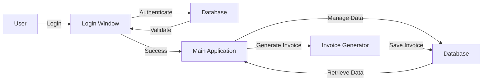

# Invoicing System
The Invoicing System is a comprehensive application designed to manage invoices, clients, products, and coupons for a business. It provides a user-friendly interface for users to log in, view, and manage their data.

## Key Features
* User authentication and authorization
* Client management
* Product management
* Coupon management
* Invoice generation
* Data export to Excel and PDF

## Directory Hierarchy
```markdown
.
├── .gitignore
├── README.md
├── app.py
├── database.py
├── dialogs
│   ├── __init__.py
│   ├── cliente_dialog.py
│   ├── cliente_manual_dialog.py
│   ├── cupon_dialog.py
│   └── producto_dialog.py
├── estructura_propuesta.txt
├── login_window.py
├── main.py
├── models
│   ├── __init__.py
│   ├── cliente.py
│   ├── configuracion.py
│   ├── cupon.py
│   ├── detalle_factura.py
│   ├── factura.py
│   └── producto.py
├── models.py
├── templates
│   └── invoice_template.html
├── utils
│   ├── __init__.py
│   ├── config_manager.py
│   ├── excel_utils.py
│   ├── invoice_generator.py
│   ├── pdf_converter_module.py
│   └── whatsapp_sender_module.py
└── views
    ├── __init__.py
    ├── clientes_view.py
    ├── configuracion_view.py
    ├── cupones_view.py
    ├── facturacion_view.py
    ├── facturas_view.py
    ├── productos_view.py
    └── usuarios_view.py
```

## Module Functionality
The Invoicing System consists of several modules, each responsible for a specific functionality:
* `app.py`: The main application module, responsible for initializing the application and handling user interactions.
* `database.py`: The database module, responsible for interacting with the database and performing CRUD operations.
* `dialogs`: A package containing dialog modules for client, product, and coupon management.
* `models`: A package containing model modules for client, product, coupon, and invoice data.
* `utils`: A package containing utility modules for configuration management, Excel and PDF generation, and WhatsApp sending.
* `views`: A package containing view modules for client, product, coupon, and invoice management.

## Prerequisites and Environment Setup
### System Prerequisites
* Python 3.8 or later
* Tkinter library
* Database library (e.g., MySQL, PostgreSQL)

### Virtual Environment Setup
Since the project uses a `requirements.txt` file, we will create a standard Python virtual environment using `venv`.
```bash
python -m venv venv
source venv/bin/activate
pip install -r requirements.txt
```

### Configuration
The application uses environment variables and a JSON configuration file.
#### Environment Variables
The following environment variables are required:
* `DB_HOST`: The database host
* `DB_USER`: The database username
* `DB_PASSWORD`: The database password
* `DB_NAME`: The database name

Example:
```bash
export DB_HOST="your_db_host"
export DB_USER="your_db_user"
export DB_PASSWORD="your_db_password"
export DB_NAME="your_db_name"
```

#### JSON Configuration File
The application uses a JSON configuration file named `config.json`. The file should contain the following structure:
```json
{
    "database": {
        "host": "your_db_host",
        "user": "your_db_user",
        "password": "your_db_password",
        "name": "your_db_name"
    },
    "invoice": {
        "template": "invoice_template.html"
    }
}
```
Replace the placeholder values with your actual database credentials and invoice template file.

## Installation
To install the application, run the following command:
```bash
pip install -r requirements.txt
```

## Usage Example
To run the application, execute the following command:
```bash
python main.py
```

## Usage Restrictions
The application requires a database connection to function properly. Ensure that the database credentials are correct and the database is accessible.

## Workflow Diagram

Note: This diagram illustrates the high-level workflow of the application, from user login to invoice generation.